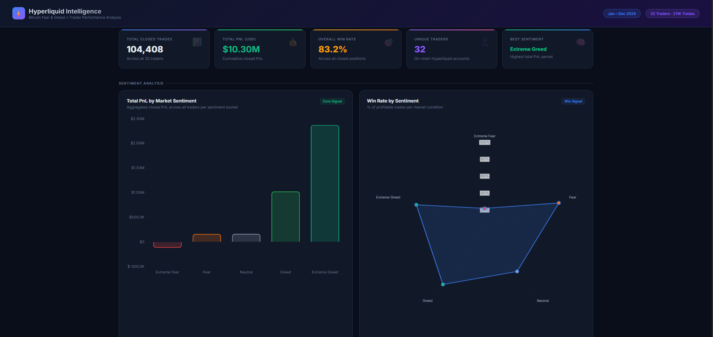
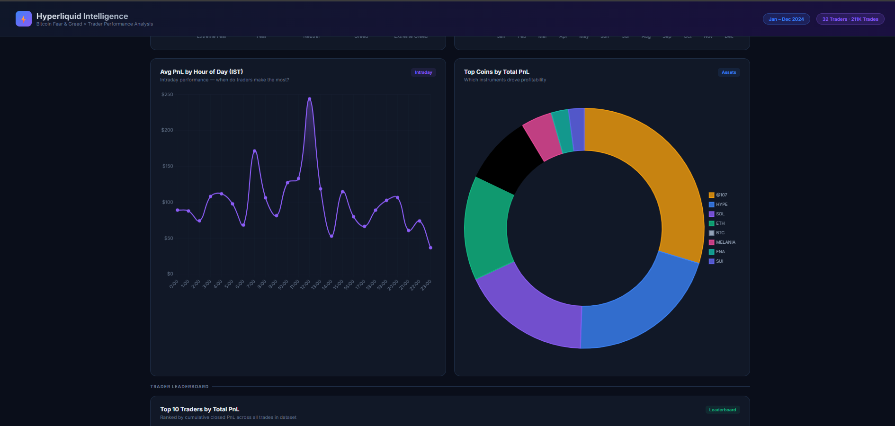
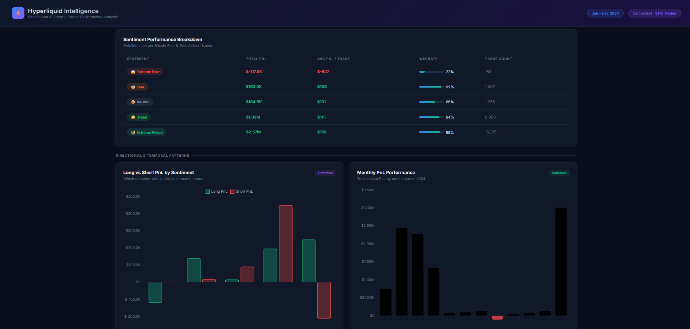
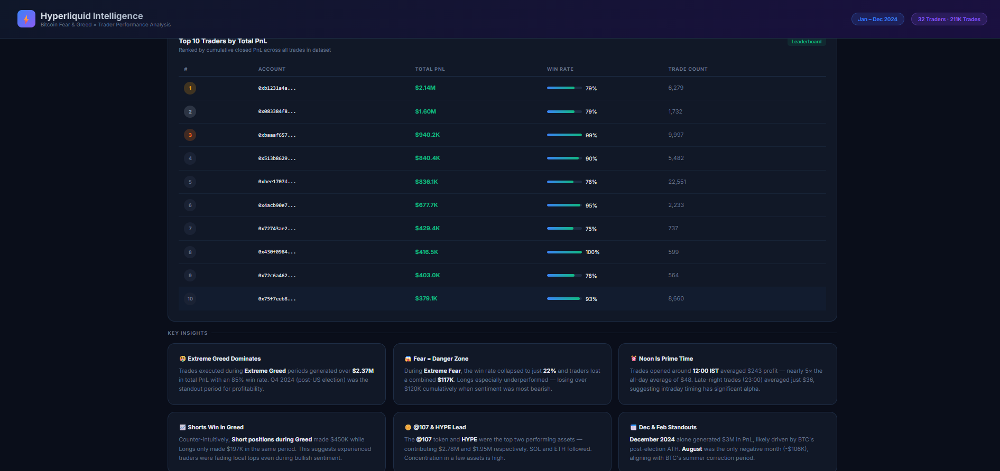

# Prime_Trade — Hyperliquid Trader Intelligence Dashboard

A data science project analyzing the relationship between **Bitcoin Fear & Greed Index** and **trader performance** on Hyperliquid, built as part of a Web3 trading internship assignment.

🔗 **Live Demo:** [crazyshubham.github.io/Prime_Trade](https://crazyshubham.github.io/Prime_Trade/)

---

## Overview

This dashboard explores how market sentiment affects trading behavior and profitability across 32 on-chain traders on Hyperliquid. By merging historical trade data with the Bitcoin Fear & Greed Index, it uncovers hidden patterns that can drive smarter trading strategies.

---

## Dataset

| Dataset | Description |
|---|---|
| Historical Trader Data | 211,000+ trades from Hyperliquid (Jan–Dec 2024) |
| Bitcoin Fear & Greed Index | Daily sentiment classification across 2024 |

**Columns in trader data:** Account, Coin, Execution Price, Size Tokens, Size USD, Side, Timestamp IST, Start Position, Direction, Closed PnL, Fee, and more.

---

## Screenshots

### KPI Overview & Sentiment Analysis


### Directional & Temporal Patterns


### Hourly PnL & Top Coins


### Trader Leaderboard & Key Insights


## Key Findings

- **Extreme Greed = Best Performance** — Traders generated $2.37M in PnL during Extreme Greed periods with an 85% win rate
- **Extreme Fear = Danger Zone** — Win rate collapsed to just 22% during Extreme Fear, with $117K in combined losses
- **Noon Is Prime Time** — Trades at 12:00 IST averaged $243 profit, nearly 5× the all-day average
- **Shorts Win During Greed** — Short positions during Greed periods outperformed longs ($450K vs $197K), suggesting experienced traders faded local tops
- **December 2024 Dominated** — Post-election BTC rally drove $3M in PnL in a single month
- **Top Assets** — @107 and HYPE led all instruments, contributing $2.78M and $1.95M respectively

---

## Dashboard Features

- KPI cards — total trades, cumulative PnL, win rate, trader count
- Sentiment vs PnL bar chart
- Win rate radar chart by sentiment
- Long vs Short PnL comparison by sentiment
- Monthly PnL performance (Jan–Dec 2024)
- Hourly average PnL heatmap
- Top coins by profitability (donut chart)
- Top 10 trader leaderboard

---

## Tech Stack

| Layer | Technology |
|---|---|
| Frontend | HTML5, CSS3, Vanilla JavaScript |
| Charts | Chart.js 4.4 |
| Data Processing | Python (pandas, numpy) |
| Hosting | GitHub Pages |

---

## Project Structure

```
Prime_Trade/
├── index.html       # Main dashboard layout
├── styles.css       # Dark theme styling
├── charts.js        # Chart.js logic and interactivity
└── chart_data.js    # Pre-processed dataset (JSON)
```

---

## Running Locally

Just open `index.html` in any browser — no server or installation needed.

```bash
git clone https://github.com/crazyshubham/Prime_Trade.git
cd Prime_Trade
open index.html
```

---

## Author

**Shubham Upadhyay**  
Data Science Internship Assignment — Web3 Trading Analytics  
[github.com/crazyshubham](https://github.com/crazyshubham)
